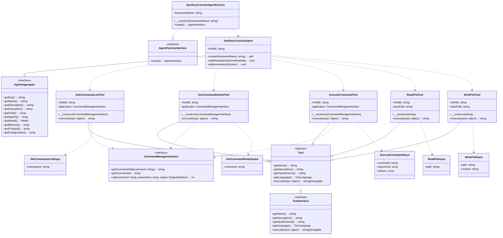

# Symfony Console Agent 🎭

[](https://packagist.org/packages/llm-agents/agent-symfony-console)
[](https://packagist.org/packages/llm-agents/agent-symfony-console)
[](https://packagist.org/packages/llm-agents/agent-symfony-console)

Welcome to the Symfony Console Agent, your new bestie for turning natural language into command-line magic. This nifty
agent understands your human babble and translates it into console commands. It's like having a super-smart CLI
assistant right at your fingertips!

### What's the deal? 🤔

Ever wished you could just tell your console what to do in plain English? Well, now you can! This agent takes your
casual requests and figures out which Symfony command to run. It's perfect for devs who are new to a project, can't
remember exact command syntax, or just feeling a bit lazy (we've all been there).

**Here's a short video to show you how it works:**

[](https://youtu.be/Tlu6PyL3Ur4)

### Requirements 📋

- PHP 8.3 or higher (we're living in the future, baby!)
- Symfony Console component
- A sense of humor (optional, but highly recommended)

### Installation

First, make sure you've got Composer installed. Then, run this command to add the Symfony Console Agent to your project:

```bash
composer require llm-agents/agent-symfony-console
```

### Setup in Spiral Framework

1. Open up your `app/src/Application/Kernel.php` file.
2. Add the bootloader like this:
   ```php
   public function defineBootloaders(): array
   {
       return [
           // ... other bootloaders ...
           \LLM\Agents\Agent\SymfonyConsole\Integrations\Spiral\SymfonyConsoleBootloader::class,
       ];
   }
   ```

And that's it! Your Spiral app is now ready to use the agent.

### Laravel

For Laravel, there's a service provider you can use:

```php
// bootstrap/providers.php
return [
    // ... other providers ...
    LLM\Agents\Agent\SymfonyConsole\Integrations\Laravel\SymfonyConsoleServiceProvider::class,
];
```

## Usage

To start using the Symfony Console Agent, you'll need to implement the
`LLM\Agents\Agent\SymfonyConsole\CommandManagerInterface`. interface. This interface is responsible for fetching command
help, listing available commands, and executing commands.

**Here's an example of how you might use it in a Laravel application:**

```php
<?php

declare(strict_types=1);

namespace LLM\Agents\Agent\SymfonyConsole\Integrations\Laravel;

use Illuminate\Contracts\Console\Kernel;
use LLM\Agents\Agent\SymfonyConsole\CommandManagerInterface;
use Symfony\Component\Console\Output\BufferedOutput;
use Symfony\Component\Console\Output\OutputInterface;

final readonly class ArtisanCommandManager implements CommandManagerInterface
{
    public function __construct(
        private Kernel $application,
        private array $enabledNamespaces = [
            'make:',
            'db:',
            'migrate',
            'route:list',
        ],
    ) {}

    public function getCommandHelp(string $command): string
    {
        $output = new BufferedOutput();
        $this->application->call($command, ['--help' => true], $output);

        return $output->fetch();
    }

    public function getCommands(): array
    {
        $commands = $this->application->all();

        $availableCommands = [];
        foreach ($this->enabledNamespaces as $namespace) {
            foreach ($commands as $name => $command) {
                if (\str_starts_with($name, $namespace)) {
                    $availableCommands[$name] = $command;
                }
            }
        }

        return $availableCommands;
    }

    public function call(\Stringable|string $command, array $parameters = [], ?OutputInterface $output = null): int
    {
        return $this->application->call($command, $parameters, $output);
    }
}
```

## Class diagram



## Want to help out? 🤝

We love contributions! If you've got ideas to make this agent even cooler, here's how you can chip in:

1. Fork the repo
2. Make your changes
3. Create a new Pull Request

Just make sure your code is clean, well-commented, and follows PSR-12 coding standards.

## License 📄

This project is licensed under the MIT License - see the [LICENSE](LICENSE) file for details.

---

That's all, folks! If you've got any questions or run into any trouble, don't hesitate to open an issue.